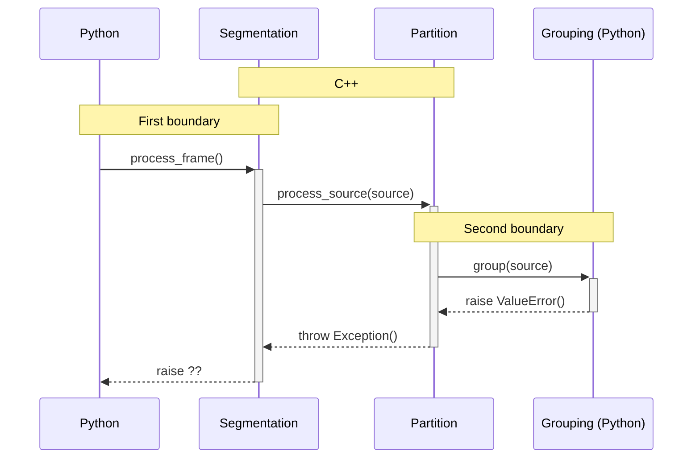

[TL;DR: Jump to the solution](#solution)

One of the objectives of sourcextractor++'s  Python wrapper is to allow users
to override parts of the pipeline with their algorithm. For instance, rely on
sourcextractor++'s segmentation and partition, do the grouping their way, and
then keep going with the measurement and output generation: sourcextractor++
crosses a language boundary twice:



However, the core of sourcextractor++ does not need to know it is being called
from Python. We need to wrap the API, and make sure we translate errors coming
from Python into exceptions understood by the C++ side.

`boost::python` already translate errors into exceptions of the type
[`boost::python::error_already_set`](https://www.boost.org/doc/libs/1_54_0/libs/python/doc/v2/errors.html#error_already_set-spec),
which, however, does *not* inherit from `std::exception`.
Letting it propagate will cause issues in parts of the code that need to know
an error happened. For instance:

```c++
try {
	do_something(source);
} catch (const std::exception& exc) {
	log_error(exc);
	stop_measurement_process();
}
```

If `do_something` calls Python and raises an exception, things will not be
orderly shut down. We could add a catch-all, but that's ugly, or explicitly
catch `boost::python::error_already_set`, but that breaks the isolation.

Of course, this is easy to solve. Since we have to wrap calls to Python with a
compatible C++ API, we do the translation there:

```c++
try {
	call_python(source);
} catch (const boost::python::error_already_set&) {
	throw Pyston::Exception();
}
```

That exception inherits from `std::exception` and translates the error
retrieved with [`PyErr_Fetch`](https://docs.python.org/3/c-api/exceptions.html#c.PyErr_Fetch),
so we can log the error message, for instance.

This works OK, but when `Pyston::Exception`[^1] reaches back the Python
interpreter, boost will re-translate the exception into a Python exception,
and the resulting error and backtrace are not very useful:

```
Traceback (most recent call last):
  File "/home/aalvarez/Work/Projects/SourceXtractorPlusPlus/SourceXtractorPlusPlus/SEPythonWrapper/scripts/CustomGroupingDemo.py", line 175, in <module>
    run_sourcextractor(parse_config_file(args.config_file), args.output_file)
  File "/home/aalvarez/Work/Projects/SourceXtractorPlusPlus/SourceXtractorPlusPlus/SEPythonWrapper/scripts/CustomGroupingDemo.py", line 148, in run_sourcextractor
    pipe().get()
  File "/home/aalvarez/Work/Projects/SourceXtractorPlusPlus/SourceXtractorPlusPlus/SEPythonWrapper/python/sourcextractor/pipeline.py", line 43, in __call__
    self.__first()
RuntimeError: KeyError: 'Something bad happened
2022-10-18T10:56:45CEST Python::Interpreter  INFO : Python GIL acquired 48 times
```

The error appears to be a `RuntimeError` triggered at the first boundary.

How to propagate the original exception back to Python, so the backtrace
gives us the actual line where it happened?
Not catching `boost::python::error_already_set ` works, but we break other
parts of the code again.

<a name="solution"/>

We need to store the original error in `Pyston::Exception` when converting
Python to C++ on the second boundary, and
[register an exception translator](https://www.boost.org/doc/libs/1_51_0/libs/python/doc/v2/exception_translator.html#register_exception_translator-spec)
that recovers the error with [`PyErr_Restore`](https://docs.python.org/3/c-api/exceptions.html#c.PyErr_Restore)
when crossing the first boundary.

```c++
namespace Pyston {

// The exception (that inherits from std::exception) keeps a
// reference to the error:
Exception::Exception() {
  GILLocker locker;

  PyObject *ptype, *pvalue, *ptraceback;
  PyErr_Fetch(&ptype, &pvalue, &ptraceback);
  PyErr_NormalizeException(&ptype, &pvalue, &ptraceback);

  m_error_type      = py::object(py::handle<>(ptype));
  m_error_value     = py::object(py::handle<>(pvalue));
  m_error_traceback = py::object(py::handle<>(py::allow_null(ptraceback)));

// Get the error message and exception type
py::object err_msg_obj(py::handle<>(PyObject_Str(pvalue)));
m_error_msg = py::extract<std::string>(err_msg_obj);
if (m_error_msg.empty()) {
  py::object err_repr_obj(py::handle<>(PyObject_Repr(pvalue)));
  m_error_msg = py::extract<std::string>(err_repr_obj);
}
py::object err_msg_type(py::handle<>(PyObject_GetAttrString(ptype, "__name__")));
m_error_msg = std::string(py::extract<std::string>(err_msg_type)) + ": " + m_error_msg;

// Generate traceback
if (ptraceback) {
  for (auto traceback = m_error_traceback; traceback; traceback = traceback.attr("tb_next")) {
    Location loc;
    loc.lineno   = py::extract<long>(traceback.attr("tb_lineno"));
    loc.filename = py::extract<std::string>(traceback.attr("tb_frame").attr("f_code").attr("co_filename"));
    loc.funcname = py::extract<std::string>(traceback.attr("tb_frame").attr("f_code").attr("co_name"));
    m_traceback.emplace_back(loc);
  }
}

// Done
PyErr_Clear();
}

// It provides a method to restore the error on the Python interpreter
void Exception::restore() const {
  PyErr_Restore(py::xincref(m_error_type.ptr()), py::xincref(m_error_value.ptr()), py::xincref(m_error_traceback.ptr()));
}

} // end of namespace
```

And, on the Python module, we register a translator for when the exception goes
back into Python.

```c++

BOOST_PYTHON_MODULE(_SEPythonModule) {
  ...
  py::register_exception_translator<Pyston::Exception>([](const Pyston::Exception& exc) { exc.restore(); });
 ...

```

Now the traceback is more valuable and points to the line that triggered the
error:

```
Traceback (most recent call last):
  File "/home/aalvarez/Work/Projects/SourceXtractorPlusPlus/SourceXtractorPlusPlus/SEPythonWrapper/scripts/CustomGroupingDemo.py", line 175, in <module>
    run_sourcextractor(parse_config_file(args.config_file), args.output_file)
  File "/home/aalvarez/Work/Projects/SourceXtractorPlusPlus/SourceXtractorPlusPlus/SEPythonWrapper/scripts/CustomGroupingDemo.py", line 148, in run_sourcextractor
    pipe().get()
  File "/home/aalvarez/Work/Projects/SourceXtractorPlusPlus/SourceXtractorPlusPlus/SEPythonWrapper/python/sourcextractor/pipeline.py", line 43, in __call__
    self.__first()
  File "/home/aalvarez/Work/Projects/SourceXtractorPlusPlus/SourceXtractorPlusPlus/SEPythonWrapper/scripts/CustomGroupingDemo.py", line 125, in __call__
    raise KeyError("Something bad happened")
KeyError: 'Something bad happened.'
```

In retrospect, this is kind of "duh!" but since boost's documentation does
not seem to mention this (I didn't see?), well, I put it here in case
someone finds it when searching for something along these lines.

[^1]: **Not** [this Pyston](https://www.pyston.org/). I am just bad at naming things.


